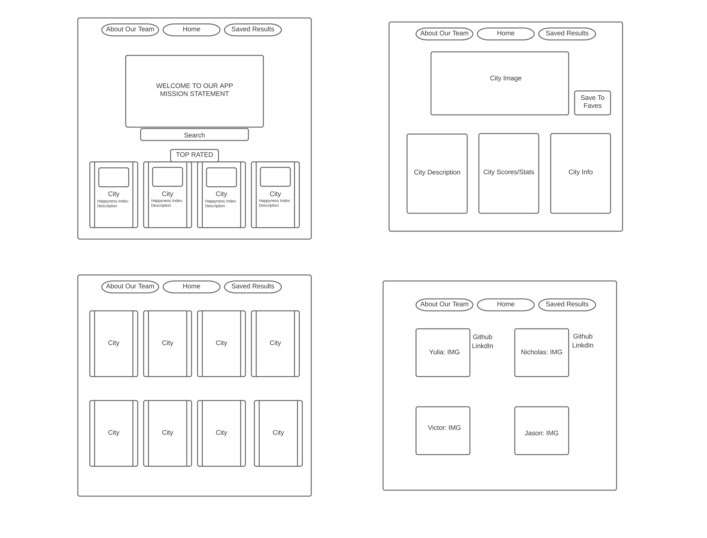
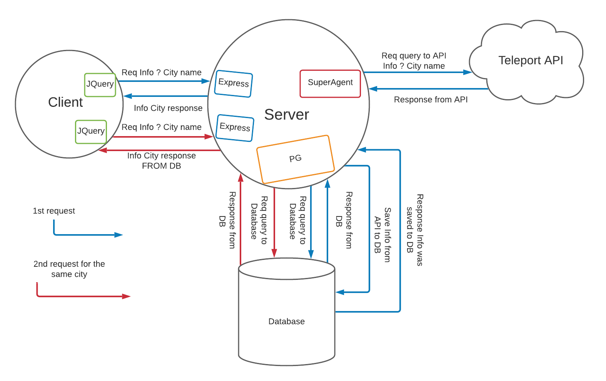
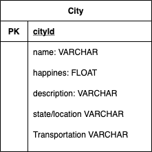
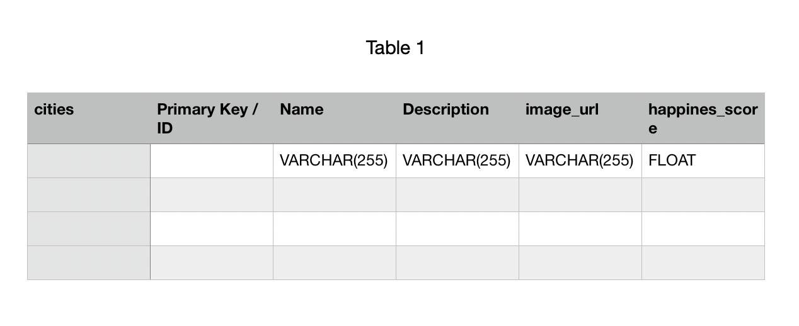

# Fifth_Element_ProjectTeam
This is the start of our groups 301 Final Project. 

## Wireframes

## Getting Started:
 - clone down the repository `https://github.com/nacerillo/Fifth_Element_ProjectTeam.git`
 - run `npm install` 
 - make sure that the following are also installed: `npm install -S express posgress dotenv`
 - run the following commands to connect to the DBs: 
     - `psql -d DB_NAME -f schema.sql`
     - `psql -d DB_NAME -f fav_city.sql`
 - run the application using terminal command `nodemon`

## User Stories

**Story #1:**

As a user, I want to view information about living in a particular city, so that I can make a more informed decision about moving there.

**Feature Tasks:**

- On homepage, user can type a city into search 
- City search routes to render a new page “details.
- Page rendered on ‘details.ejs’ displays city info including(but not limited to)…
  - General City description
  - Peoples happiness index in that city
  - Ratings on Housing/Safety/Environment Quality
____________________________________________________________________________________

**Story #2:**
As a user, I want to want to find a location with the highest happiness index, so that I can make a decision about whether to go there, or not.

**Feature Tasks:**

- User can search for a city using a search bar.
- The happiness index and more general information is  displayed on a separate page.

**Acceptance Test:**

- After entering a city the information for the city matches the searched city and is displayed on a separate page.
- Ensure the city info selected in the search matches the information displayed.
____________________________________________________________________________________

**Story #3:**
As a user I want to be able to go back to the website where I found the city information and recall past searches so that I don’t have to redo a search every time.

**Feature Tasks:**

- User can search for a city using a search bar.
- The transportation options in that city are displayed along with other information about the area.

**Acceptance Test:**

- After entering a city the transportation information for the city is displayed on a separate screen.
____________________________________________________________________________________

**Story #4:**
As a user, I want to be able to pull up transportation info about a specific city, so that I will know the best way to get around in that city.

**Feature Tasks:**

- User will be able to save searches and have them displayed on a ‘saved searches’ page.
- be able to access transportation data over the API

**Acceptance Test:**

- User able to save search information.
- After information is saved the user is able to pull up previously saved information on a separate page.
____________________________________________________________________________________

**Story #5:**
As a user I want a website with a easy to remember name so that I can return with ease.  

**Feature Tasks:**

- User will have an easy to remember domain name that is the same every time the user returns.

**Acceptance Test:**

- User is able to view the website using a domain name that is easy to remember.
____________________________________________________________________________________

## Domain Modeling

## Entity Relationship Diagram

## Project Members:

- Nicholas Cerillo 
- Victor Sullvian 
- Jason Taisey
- Yuliya Barysevich

Update

