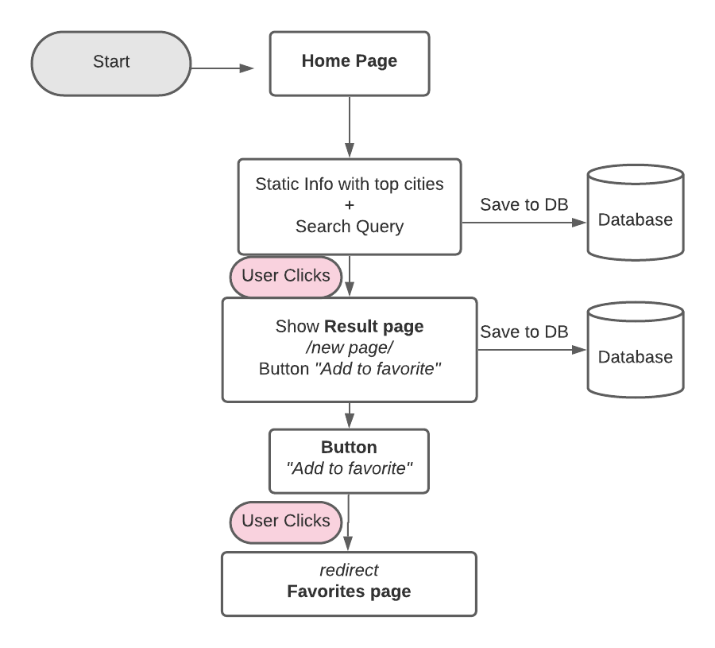

# Software Requirements

## Vision

**What is the vision of this product?**

- To create a webapp  that shares city information that will aid in someone deciding if this is a city that user would like to move to or visit. It will also show rankings for things like how happy residents are, and how safe they actually feel living where they do.

**Why should we care about your product?**

- Because people deserve to be happy, and to make decisions that will lead to the greatest amount of happiness for them. One’s environment is a major factor when it comes to how happy someone is. Not only will our app pull up objective information about the cities.

## Scope (In)

1. User will be able to retrieve details about a city they search for.
2. Cities with highest “Happiness” will be marked on the first page.
3. Search results will be saved to a database so that repeated searches will be more efficient.
4. User will be able to view both the “Scores” the city gets according to surveys, as well as objective information/details about a city.
5. Users will be able to save cities to a “favorites” database, which will be rendered on a separate page that they can visit.

## Scope (Out)

1. Will not book your flight
2. Won’t be able to manage travel plans.
3. Cannot make any kind of purchase via app.
4. Won’t have a “secure” user log in.

## Minimum Viable Product

An application that will allow a user to get information about a city after searching for it. information about cities will come from info taken from the TELEPORT and (potentially) the LocationIQ APIs.  A user will also have the option of saving and deleting cities and to/from a list of favorites that they will be able to return to on the site.

## Functional Requirements

1. Database will store recent searches for more efficient search results.
2. A user can add and remove cities from favorites
3. When a user searches for a city, a single city will render as a result.

### Data Flow

## Non-Functional Requirements

**Usability:**

- Website will function at a domain address allowing for easy access for user(s)to return.  The name will be simple and easy to remember.  All pages will be properly connected and display an error message if a page is unable to display.

**Testability:**

- Proper connections can be tested by simple input of data on the page.  This will allow information returned to be checked for accuracy as well as any broken connections to be resolved.  Database configuration and storage can be easily checked by inputting new data and checking the display on the favorites page.